# Caltech-Bird-Classification-Using-Resnet101-t
**📖 Table of Contents**

 ➤ OverView

 ➤ DataSet

 ➤ Getting Started

      1-Data Prepration
      2-Perceptron
      3-ResNet-101
      4-Visualization

**☁️ Overview** 

 Using Caltech Bird dataset on fully connected neural network and  pretrained Resnet101 from keras  (after applying fine-tuning)
 

**🔸 DataSet**

The Caltech-UCSD Birds-200-2011  dataset of 200 bird species . it baseline experients for multi-class categorization

**📖 Getting Started**
  
_1-Data Preparation_
 
Using ImageDataGenerator  from Keras
 to  split data into train and validate and test

_2-Perceptron_
 
To implement  a fully connected neural network ( multi-layer perceptron) Therefore, need  to 
 
 -Resize the image to 32x32

 - Use Sequential API in keras
 - Import layers from keras.layers
 
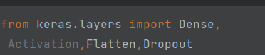
 - Build  Fully connected neural network
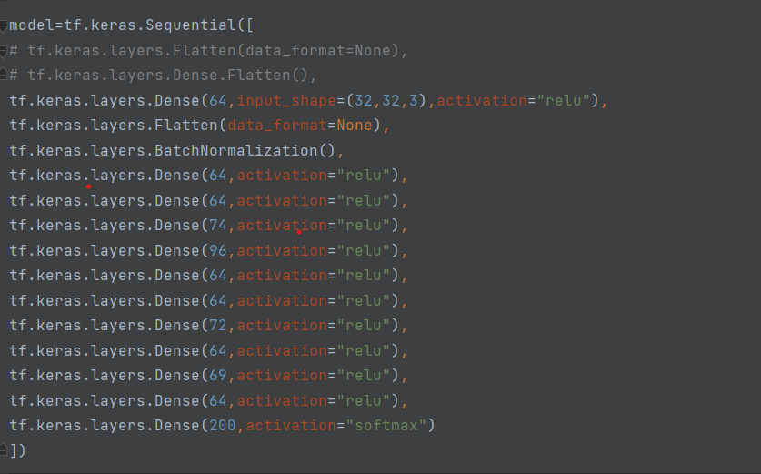

 - Optimize the model 
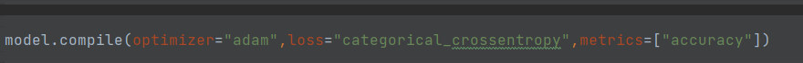
 - Train the model and Plot loss and accuracy 

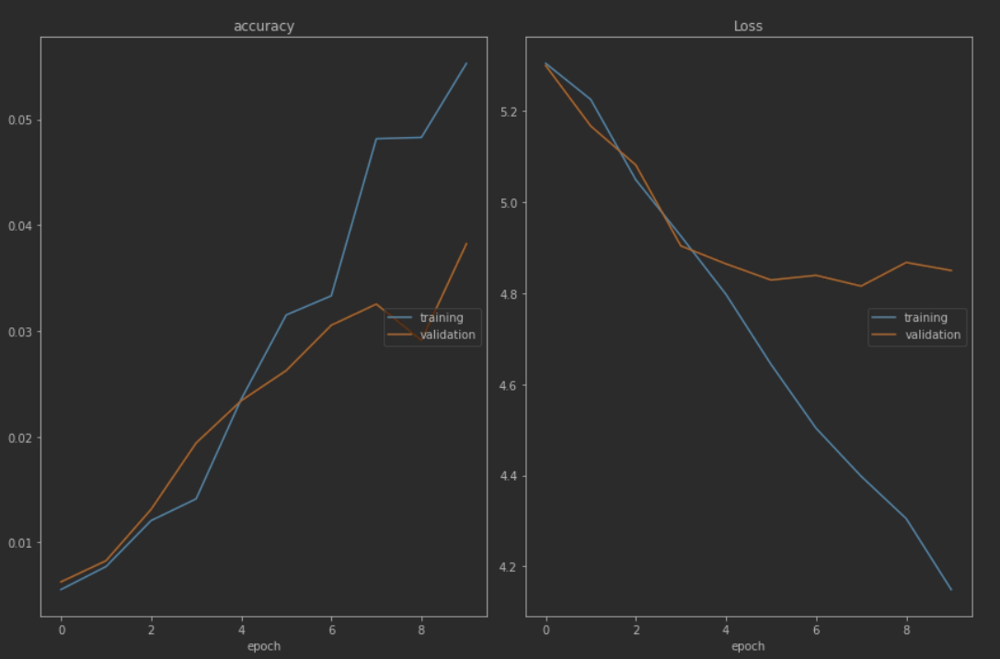
 - Compare between actual classes and predicted classes
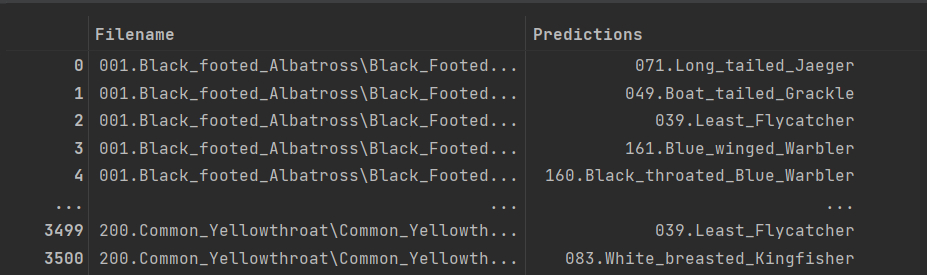
_3- ResNet101_
 
this step  divided into two-step

  **First step**
 - Removing the FC layers, but leaving the other layers intact
   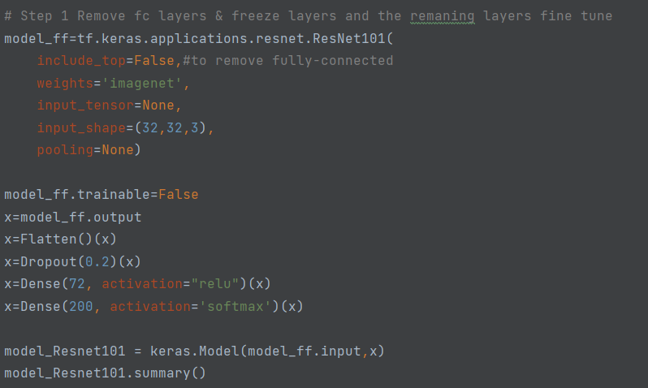
  

 - Plot accuracy and loss

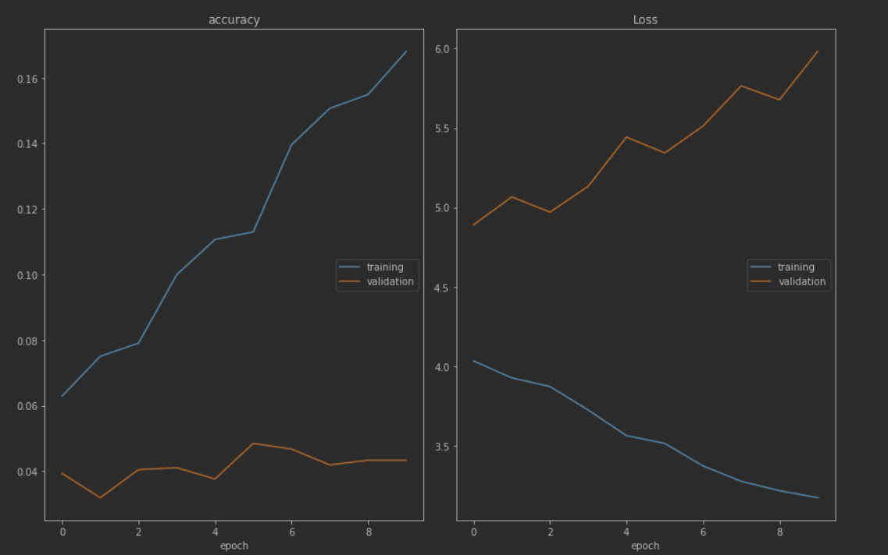
  **Second step**
 - unfreeze some convolutional layers and retrain the network
 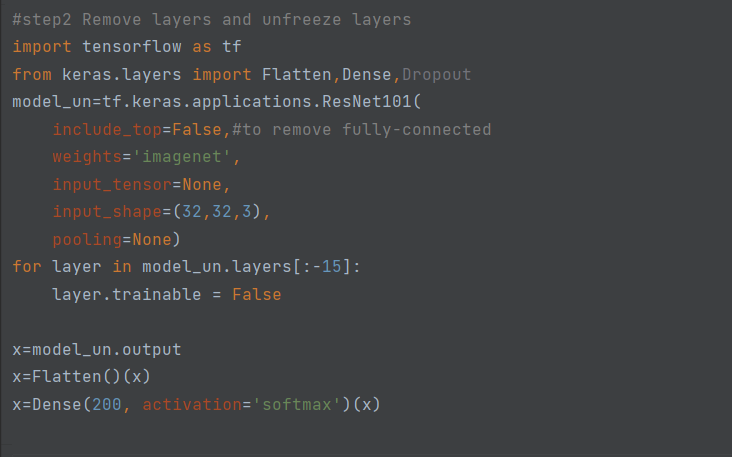

 - Plot Accuracy and loss
      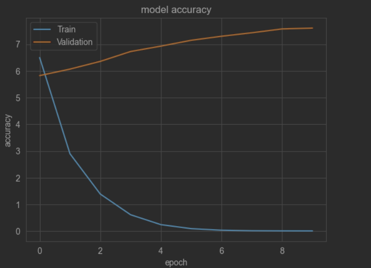     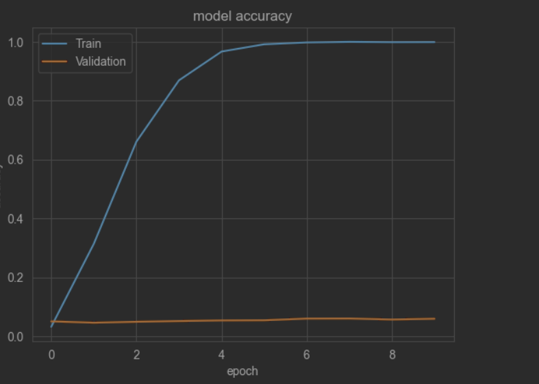

 _4- Visualization_ 
  
 Visualize the filter  by choosing  conv2_block1_2_conv layer 
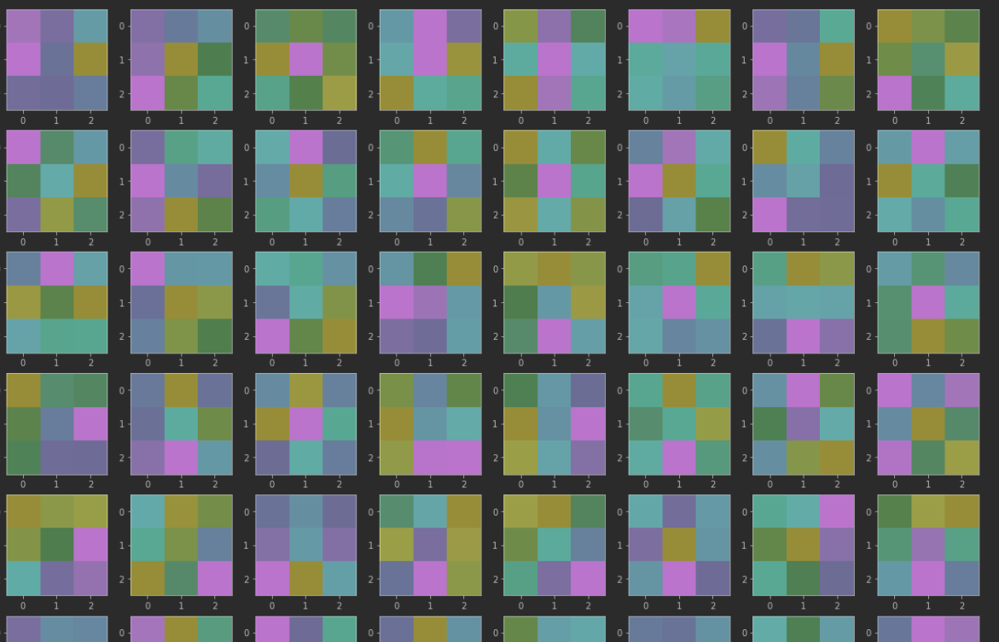

 Use t-SNE to observe clusters
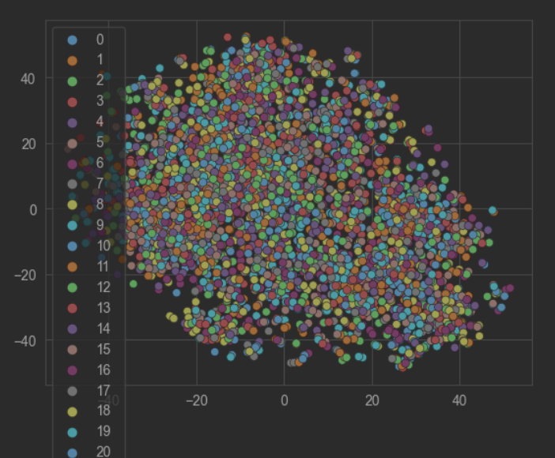

 Visualize the activation maps
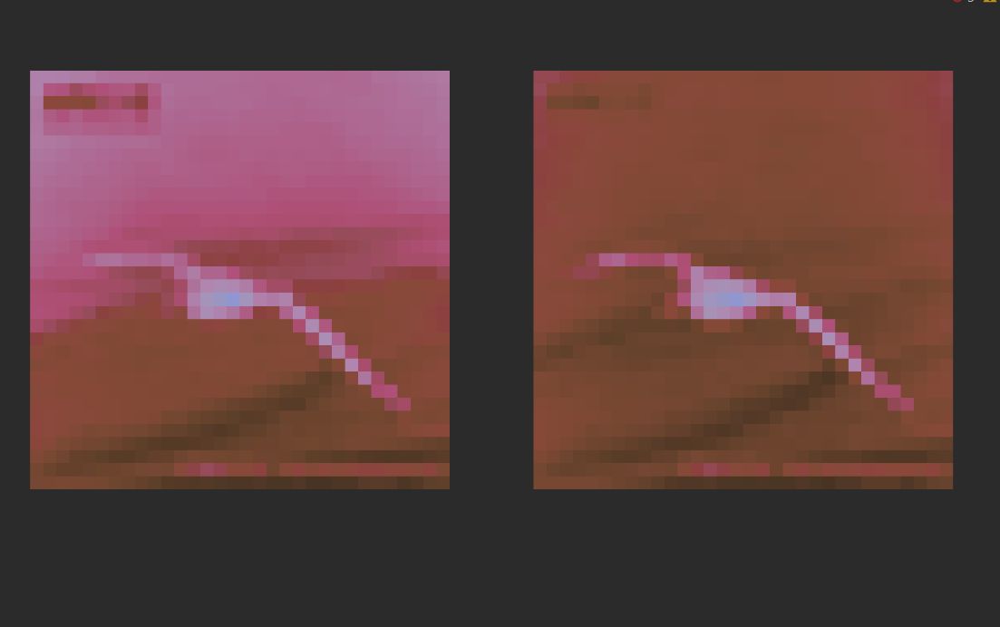
